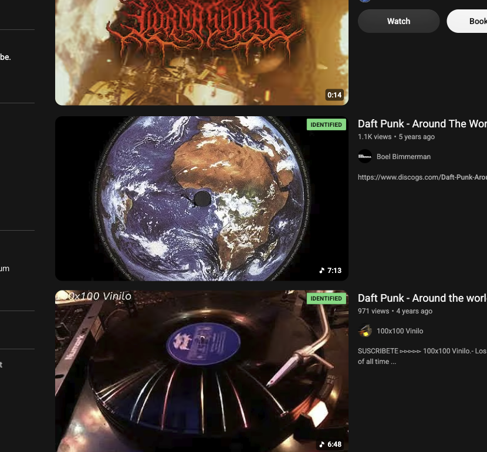

<p align="center">
  <a href="https://github.com/dangercharlie/YT-Metadata-Pro"></a>
  <a href="https://github.com/dangercharlie/YT-Metadata-Pro/releases/latest"></a>
  <a href="https://github.com/dangercharlie/YT-Metadata-Pro"></a>
  <br/>
  <a href="https://github.com/dangercharlie/YT-Metadata-Pro/actions/workflows/validate-extension.yml"></a>
  <a href="https://github.com/dangercharlie/YT-Metadata-Pro"></a>
  <a href="https://github.com/dangercharlie/YT-Metadata-Pro"></a>
  <a href="https://github.com/dangercharlie/YT-Metadata-Pro"></a>
</p>

# YT Metadata Pro

**YT Metadata Pro** is a lightweight Chrome extension that saves you from opening every
YouTube result just to find out whether YouTube has already identified the music in it.

It badges YouTube search results with a green **IDENTIFIED** label when YouTube's own
metadata shows the upload has been matched to a registered musical work — including
re-uploads, vinyl rips and remixes that are mixed in with already-identified results.

<p align="center">
  
</p>

<p align="center">
  <em>Genuine capture: two vinyl rips of the same Daft Punk track, both matched by YouTube and badged <strong>IDENTIFIED</strong>.</em>
</p>

---

## Why?

If you upload or curate music on YouTube, the question that matters is not "is this labelled
as music?" but:

> Has YouTube already identified this recording as a registered work?

Official releases are usually matched. The interesting cases are the ones that are *not* —
a vinyl pressing, a 12" B-side, a dub, a remix — sitting in the same results list as the
official version. This extension puts that answer on the thumbnail so you can see it before
you click.

---

## What It Does

- Runs as a Chrome extension on YouTube pages
- Finds video IDs from visible search results and thumbnails
- Asks YouTube's own page data whether the upload carries a **song-credits / music panel**
- Adds a green **IDENTIFIED** badge, with the matched song, artist and album in the tooltip
- Caches results locally so repeat lookups are rare
- Requires **no API key** and **no account**

---

## What It Does Not Do

YT Metadata Pro is not a copyright oracle.

- It does not determine legal reuse rights
- It does not prove a video is safe to sample, remix, upload, monetize, or reuse
- It does not download videos or audio
- It does not bypass YouTube limits, permissions, or platform controls
- It does not consult Content ID claims directly — that data is partner-only
- **It does not guarantee that "no badge" means "not claimed"**

No badge means:

> YouTube did not surface an identification for this upload.

It does **not** mean:

> Safe to use.

---

## How it works

YouTube already knows which uploads contain music it has identified as a registered work —
it just buries that answer in a panel you only see after opening the video. This extension
surfaces it on the thumbnail instead.

When a result scrolls into view, the extension asks YouTube's own page data whether that
upload carries a song-credits / music panel. If it does, the thumbnail gets a green
**IDENTIFIED** badge, and hovering it shows the matched song, artist and album.

Two details worth knowing:

- **It reads YouTube's identification, not a legal opinion.** A badge means YouTube matched
  this upload to a registered work. It is not a statement about your rights to reuse it.
- **It matches recordings, not songs.** The official release of a track is often identified
  while a vinyl pressing, B-side, dub or remix of the *same song* is not. In practice that is
  usually the distinction worth knowing — and it is why this exists.

Results are cached locally, lookups are limited to videos actually on screen, and there is no
API key, no account, and no server.

---

## A note on v1

An earlier version (v1, tagged `v1.0.0`, since retired) badged uploads using the YouTube Data
API field `contentDetails.licensedContent`. That field does not mean "this audio has been
identified" — it means *"uploaded to a channel linked to a YouTube content partner"*, a
property of the channel rather than the audio. In practice it flagged a lot of non-music
content and missed most vinyl rips. It also required every user to supply their own API key.

This version reads YouTube's own identification instead, and needs no key. The v1 source is
kept under [`archive/extension-v1-licensed-content/`](archive/extension-v1-licensed-content/)
for reference only.

<details>
<summary>What changed, and the evidence behind it</summary>

The retired field was measured against the live API across 499 videos. It fired on **66%
non-music** content — `MUSIC` appeared on news, sport and education videos — while **missing
86%** of vinyl-rip and remix results. It also returned `false` on four vinyl rips that
YouTube's own song-credits panel had already matched.

Replacing the signal also meant fixing the plumbing around it:

| Problem in v1 | Fix |
|---|---|
| Stale badges when YouTube reused a thumbnail for a different video | Badges reconciled against the video a node currently shows |
| Recycled thumbnails never re-checked; a transient error blacklisted a video forever | Bounded retry with backoff; failures are never cached |
| Substring URL matching could badge the wrong video | Video IDs parsed and compared exactly |
| Only one thumbnail element type was scanned | Covers the newer view-model components and Shorts |
| A missing API key gave no badges and no explanation | No key needed at all |

Full write-up: [`docs/HOW-WE-GOT-HERE.md`](docs/HOW-WE-GOT-HERE.md).

</details>

---

## Installation

This extension is distributed **from GitHub**, not the Chrome Web Store. That means you install
it in developer mode, and Chrome will show a developer-mode warning. That is expected for any
extension installed outside the Store.

1. Download the latest release ZIP and extract it, or clone this repo.
2. Open `chrome://extensions/`
3. Enable **Developer mode** (top right).
4. Click **Load unpacked**.
5. Select the `extension/` folder.
6. Reload any open YouTube tabs.

There is no API key to configure.

> **Updates are manual.** Unpacked extensions do not auto-update. Re-download or `git pull`
> to get new versions.

---

## Verify the build

The extension is plain JavaScript, CSS and HTML. There is **no build step, no bundler, no
dependencies and no minification** — the files in the repo are the files Chrome runs, so you
can read everything that executes.

```bash
npm run lint          # validates the package + runs parser fixture tests
npm run zip           # builds dist/YT_Metadata_Pro_Extension.zip
shasum -a 256 dist/YT_Metadata_Pro_Extension.zip
```

---

## Privacy

- **No telemetry.** No analytics, tracking, or crash reporting.
- **No backend.** Nothing is sent to any server operated by this project.
- **No API key.** Nothing to configure, nothing to leak.
- **One permission:** `storage`, used for the local identification cache.
- **One site:** the content script runs only on `youtube.com`.

The only network requests are to YouTube itself, from your own browser, for public page data.

---

## Permissions

```json
"permissions": ["storage"],
"content_scripts": [{ "matches": ["*://*.youtube.com/*"] }]
```

No `host_permissions`, no `tabs`, no `<all_urls>`. The extension reads YouTube data using
same-origin requests, so it does not need broad host access.

---

## Known Limitations

- **Best-effort.** The extension reads a YouTube endpoint that is not a documented public API.
  It can change without notice. If it stops working, the extension fails quietly — it will not
  break YouTube pages.
- **Absence is not proof.** No badge means YouTube did not surface an identification. A claim
  can in principle exist without the panel appearing.
- **Content ID matches recordings, not songs.** The official version of a track is often
  identified while a vinyl pressing, B-side or remix of the same song is not. That is expected
  behaviour, not a bug — it is usually the distinction you are looking for.
- Match data is cached locally for up to 7 days.

---

## Troubleshooting

If badges do not appear:

1. Reload the extension in `chrome://extensions/`.
2. Reload any open YouTube tabs.
3. Open DevTools on YouTube and look for logs beginning with `[YT-Metadata-Pro]`.
4. Use **Clear cache & re-check** in the extension popup.

---

## Development

The extension lives in `extension/` and is plain MV3 — no build step, no bundler, no
dependencies:

```text
extension/manifest.json
extension/content.js     # detection + badge rendering
extension/background.js  # cache management
extension/popup.html
extension/popup.js
extension/badge.css
```

Check any video from the command line:

```bash
node scripts/detect-identified.mjs dQw4w9WgXcQ
```

```bash
npm run lint     # validate package + parser fixture tests
npm run zip      # build dist/YT_Metadata_Pro_Extension.zip
```

Background reading, if you want the reasoning behind the signal:

- [`docs/HOW-WE-GOT-HERE.md`](docs/HOW-WE-GOT-HERE.md) — why v1 was retired, with evidence
- [`docs/SIGNAL-RESEARCH.md`](docs/SIGNAL-RESEARCH.md) — measured comparison of candidate signals
- [`docs/DISTRIBUTION.md`](docs/DISTRIBUTION.md) — Chrome Web Store permissions and release notes

---

## License

Released under the MIT License.

---

## Support

If you find YT Metadata Pro useful, consider buying me a coffee!
☕️ [Buy Me A Coffee](https://ko-fi.com/dangercharlie)
