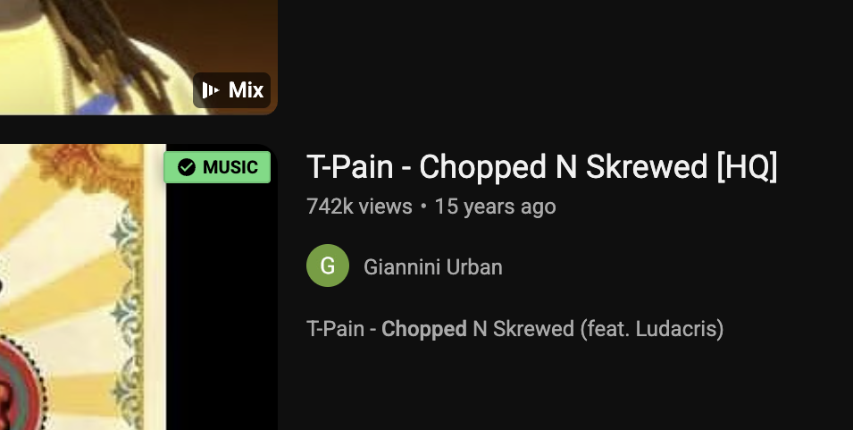

<p align="center">
  <a href="https://github.com/dangercharlie/YT-Metadata-Pro"></a>
  <a href="https://github.com/dangercharlie/YT-Metadata-Pro"></a>
  <a href="https://github.com/dangercharlie/YT-Metadata-Pro"></a>
  <br/>
  <a href="https://github.com/dangercharlie/YT-Metadata-Pro"></a>
  <a href="https://github.com/dangercharlie/YT-Metadata-Pro"></a>
  <a href="https://github.com/dangercharlie/YT-Metadata-Pro"></a>
</p>

# YT Metadata Pro

**YT Metadata Pro** is a lightweight Chrome extension for spotting YouTube videos that YouTube already marks as licensed content.

The core workflow is simple:

> Browse YouTube -> detect visible video IDs -> check YouTube metadata -> badge likely music matches

It uses the YouTube Data API v3 `contentDetails.licensedContent` signal to add a clear green **MUSIC** badge to matching search and results thumbnails.

<p align="center">
  
</p>

---

## Why?

YouTube often exposes music attribution and licensing metadata, but it is usually buried inside watch pages, descriptions, or generated metadata panels.

YT Metadata Pro solves a narrower problem:

> I want to scan YouTube results and quickly see which visible videos are already flagged by YouTube as licensed content.

It is designed for metadata triage before opening every video manually.

---

## What It Does

- Runs as a Chrome extension on YouTube pages
- Detects visible YouTube video IDs from thumbnails/results
- Calls the YouTube Data API v3 `videos` endpoint
- Requests `part=contentDetails`
- Checks `contentDetails.licensedContent === true`
- Adds a green **MUSIC** badge to matching thumbnails
- Stores your YouTube API key locally in Chrome extension storage
- Keeps the extension package simple and inspectable

---

## What It Does Not Do

YT Metadata Pro is not a copyright oracle.

- It does not determine legal reuse rights
- It does not prove a video is safe to sample, remix, upload, monetize, or reuse
- It does not perform audio fingerprinting
- It does not download videos or audio
- It does not bypass YouTube limits, permissions, or platform controls
- It does not treat missing metadata as proof that a track is safe

No badge means:

> Not flagged by this metadata signal.

It does **not** mean:

> Safe to use.

---

## Installation

### Load Unpacked For Testing

1. Clone or download this repo.
2. Open Chrome and go to:

   ```text
   chrome://extensions/
   ```

3. Enable **Developer mode**.
4. Click **Load unpacked**.
5. Select the `extension/` folder.
6. Open the extension popup.
7. Paste your own YouTube Data API v3 key.
8. Reload any open YouTube tabs.

### Build A ZIP

```bash
npm run zip
```

The ZIP is written to:

```text
dist/YT_Metadata_Pro_Extension.zip
```

---

## YouTube API Key Setup

YT Metadata Pro requires your own YouTube Data API v3 key.

1. Open Google Cloud Console.
2. Create or select a project.
3. Enable **YouTube Data API v3**.
4. Go to **APIs & Services -> Credentials**.
5. Create an **API key**.
6. Restrict the key to **YouTube Data API v3**.
7. Paste the key into the extension popup.

Do not commit API keys or paste them into issues, pull requests, screenshots, or chat.

---

## Development

This repo is intentionally plain.

The extension lives in:

```text
extension/
```

Required files:

```text
extension/manifest.json
extension/background.js
extension/content.js
extension/popup.html
extension/popup.js
```

Validation:

```bash
npm run validate:extension
npm run lint
```

Build package:

```bash
npm run zip
```

Inspect ZIP contents:

```bash
unzip -l dist/YT_Metadata_Pro_Extension.zip
```

---

## Troubleshooting

If badges do not appear:

1. Reload the extension in `chrome://extensions/`.
2. Reload any open YouTube tabs.
3. Confirm your API key is saved in the popup.
4. Open DevTools on YouTube and look for logs beginning with:

   ```text
   [YT-Metadata-Pro]
   ```

Useful log meanings:

- `Checking visible video IDs` means the content script is running.
- `Lookup complete ... licensed=0` can still mean the extension is working.
- `Lookup failed` usually means API key, quota, or API enablement needs checking.
- No logs usually means Chrome has not injected the content script into that tab yet.

---

## Privacy & Security

YT Metadata Pro keeps the workflow local and inspectable.

✅ **Local API Key Storage:** Your API key is stored in Chrome extension local storage.  
✅ **No Telemetry:** No analytics, product tracking, or crash reporting.  
✅ **No Backend:** No custom server receives your browsing data or API key.  
✅ **Simple Extension Files:** The extension is plain `manifest.json`, JavaScript, and HTML.  
❌ **No Downloading:** The extension does not download video or audio.  
❌ **No Legal Claims:** The badge is metadata triage, not rights clearance.

---

## Status

Early working prototype.

The current milestone is intentionally narrow:

> Detect visible YouTube result thumbnails and badge videos where YouTube reports `licensedContent: true`.

Tested manually with a local YouTube Data API key on YouTube search/results pages.

---

## License

MIT
